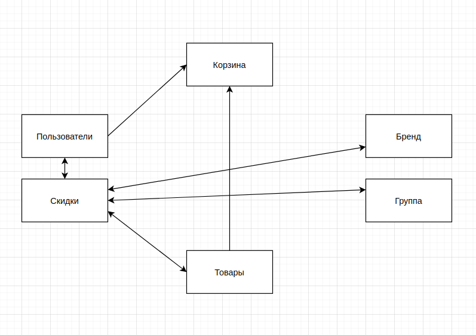

# Python
Написать код (с помощью регулярных выражений и без них) для удаления из строки незакрытых скобок вместе с их содержимым, если после них нет закрытых блоков: 'esdfd((esdf)(esdf' -> 'esdfd((esdf)'. Написать тесты для этого кода.
Решение:
```
import re
import unittest


init_string = 'esdfd((esdf)(esdf'


def with_regexp(some_string):
    return re.compile(r'\([^\)]*$').sub('', some_string)


def without_regexp(some_string):
    opened = some_string.rfind('(')
    closed = some_string.rfind(')')
    if opened == -1 or opened < closed:
        return some_string
    else:
        # на случай если открытых скобок несколько
        return without_regexp(some_string[:opened])


class TestStringCutter(unittest.TestCase):
    known_result = 'esdfd((esdf)'

    def test_with_regexp(self):
        result = with_regexp(init_string)
        self.assertEqual(self.known_result, result)

    def test_without_regexp(self):
        result = without_regexp(init_string)
        self.assertEqual(self.known_result, result)
```
# Django
А. С помощью Django ORM выбрать товары, цена которых больше или равна 100 руб., сгруппировать по категориям и посчитать количество товаров в каждой категории

Б. То же самое, но оставить лишь категории, в которых строго больше 10 товаров

В. Написать код python, который выводит в консоль перечень всех товаров. Каждая строка должна содержать следующие данные:
- название категории товара,
- наименование товара,
- цена.

По возможности, минимизировать количество обращений к базе данных и количество передаваемых данных.

Решение:
```
from django.db import models


class Category(models.Model):
    """Модель 'Категория'"""

    name = models.CharField('Группа товара', max_length=64)

    @staticmethod
    def products():
        """
        Задание 2.А
        Метод, выводящий количество товаров по категориям с
        ценой 100 руб и более
        """
        categories = Category.objects.filter(
            product__price__gte=100
        ).prefetch_related(
            models.Prefetch(
                'product_set',
                queryset=Product.objects.filter(price__gte=100)
            )
        ).distinct('id')
        for category in categories:
            print(
                f'В категории {category.name} '
                f'имеется {category.product_set.count()} '
                'товара(-ов) стоимостью 100 руб или более'
            )

    @staticmethod
    def products_in_big_categories():
        """
        Задание 2.Б
        Метод, выводящий количество товаров по категориям с
        ценой 100 руб и более, строго в категориях,
        где общее кол-во товаров больше 10
        """
        big_categories = Category.objects.annotate(
            product_counter=models.Count('product', distinct=True)
        ).filter(
            product__price__gte=100, product_counter__gt=10
        ).prefetch_related(
            models.Prefetch(
                'product_set',
                queryset=Product.objects.filter(price__gte=100)
            )
        )
        for category in big_categories:
            print(
                f'В категории {category.name} '
                f'имеется {category.product_set.count()} '
                'товара(-ов) стоимостью 100 руб или более'
            )


class Product(models.Model):
    """Модель 'Продукт'"""

    category = models.ForeignKey(
        Category,
        verbose_name='Группа',
        on_delete=models.CASCADE,
    )
    name = models.CharField(
        'Название товара',
        max_length=128,
    )
    price = models.DecimalField(
        'Стоимость единицы, руб.',
        max_digits=10,
        decimal_places=2,
    )

    @staticmethod
    def all_products():
        """
        Задание 2.В
        Насколько я понял по ТЗ, необходимо просто вывести в консоль
        все товары максимально оптимизированно
        """
        for product in Product.objects.iterator():
            print(f'Категория - {product.category.name}, '
                  f'наименование - {product.name},'
                  f' цена - {product.price}')

```
# Additional questions
#### 1. Suppose we have several independent models which have some fields in common. What type of django model inheritance should be used to avoid typing those common fields definitions in each model?
The answer is: Abstract base classes

#### 2. Suppose we have model with a custom manager:
```
class CustomManager(models.Manager):
    def get_queryset(self):
        return CustomQuerySet(self.model, using=self._db)

class Item(models.Model):
    name = models.CharField('Item', max_length=100) 
    active = models.BooleanField('Active', default=True) 
    objects = CustomManager()
```
##### Now we want the following code to work:
##### ```Item.objects.filter(pk=1).delete()``` - should set “active” attribute to False on matched records. 
##### ```Item.objects.filter(pk=1).delete_real()``` - should delete matched records from db.
##### What is the correct CustomQuerySet implementation?
The answer is: 
```
class CustomQuerySet(QuerySet): 
    def delete(self):
        self.update(active=False)
    
    def delete_real(self): 
        super(CustomQuerySet, self).delete()
```
#### 3. Suppose we have model:
```
class Person(models.Model):
    name = models.CharField('Item', max_length=100) 
    birthday = models.DateField(...)
```
##### We want to define a model field “birthday” such that django admin interface doesn't allow this field to be empty, but we can create persons with empty birthday using orm ( Person.objects.create(name='Name 1') should work).
##### What is the correct field definition?
The answer is:
```
birthday = models.DateField(null=True, blank=False)
```
# Проектирование
Предложить структуру хранения данных и технологию их обработки для проекта интернет-магазина (упрощённо). В магазине тысячи товаров различного предназначения, брендов и т.д.

В интернет-магазине необходимо предусмотреть систему скидок. Виды скидок:
- Скидка на единичный товар
- Скидка на бренд
- Скидка на группу товаров (группы: предназначение(техника, одежда,...), пол)
- Скидка клиента

Скидка имеет начало и конец действия. У каждого товара в определённый момент может быть ни одной / одна / несколько скидок. Скидка в данный момент рассчитывается как максимум из действующих скидок для товара. Скидку клиента учитывать в процессе покупки товара, при отображении каталога товаров цены с учётом скидки клиента не пересчитывать. Остальные скидки при отображении каталога должны быть показаны.
Необходимо, чтобы была возможность сортировки товаров по актуальной цене - с учётом скидок.

Какие django-приложения для решения задачи предлагаете использовать (готовые движки магазинов не предлагать)?

##### Ответ:
Упрощенная структура сущностей предлагается следующая:



Основные технологии:

- Бэкенд: Django (с использованием DRF, если необходимо API)

- СУБД: PostgreSQL

Так как со временем новые категории, бренды и товары будут появляться не так часто, для оптимизации запросов чтения можно повесить индексы на эти таблицы и использовать redis в качестве кеш-хранилища. Для взаимодействия django - redis использовать django-cacheops

Для удобного расчета скидки (одна/ни одной/несколько) предлагаю использовать GenericForeignKey.

Для отображения древовидной структуры (вида Категории -> Бренд в категории -> Товары брендов) предлагаю использовать Django MPTT.

Если требуется кастомизировать админку, можно использовать Django Suit

Для возможности сортировки товара по актуальной цене необходимо будет сделать два поля: 

base_price - базовая цена без скидки

actual_price - цена для продажи или равна base_price, или меньше

Сортировать будем по actual_price, предварительно вычисляя актуальную скидку с помощью annotate.

# SQL(PostgreSQL)
Есть таблица phones с полями: 

phone - varchar

users - int[]

Есть вторая таблица items 

id serial

user_id int

status smallint (3 - не продан, 7 - продан, 5 – резерв)
- Надо написать запрос который на заданные телефоны возвращает количество проданных вещей

Решение:
```
SELECT phn.phone, count(i.id)
FROM (
  SELECT phone, unnest(users) user_id
    FROM phones
) as phn
JOIN items i ON phn.user_id = i.user_id
WHERE
  i.status = 7
GROUP BY
  phn.phone
ORDER BY phn.phone
```
- Который возвращает в одном запросе количество и проданных и не проданных

Решение:
```
SELECT phn.phone, status, count(i.id) AS number_of_items
FROM (
  SELECT phone, unnest(users) user_id
    FROM phones
) as phn
JOIN items i ON phn.user_id = i.user_id
WHERE
  i.status in (3, 7)
GROUP BY
  phn.phone, status
ORDER BY phn.phone
```
# GIT
Создаем ветку feature_1 и делаем в ней два коммита:
```
git checkout -b feature_1
git commit
git commit
```
Далее, удаляем второй коммит (он же последний в данном случае) и мерджим feature_1 в master
```
git reset --hard HEAD^
git checkout master
git merge feature_1
```